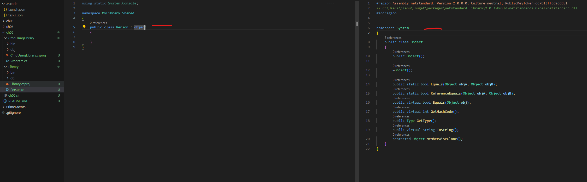

### OOP

**Classes ingeriting from System.Object**

*Good Practice: Use the enum values to store combinations of discrete options.
Derive an enum type from byte if there are up to eight options, from ushort
if there are up to 16 options, from uint if there are up to 32 options, and from
ulong if there are up to 64 options.*